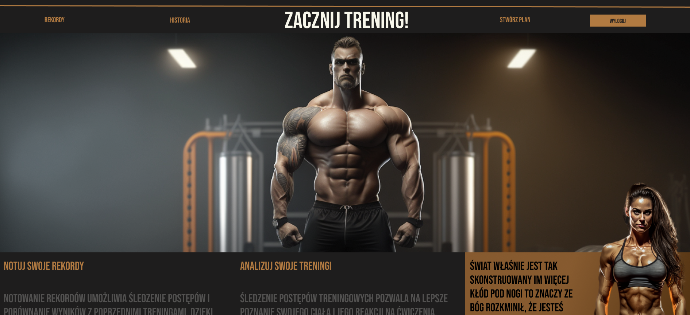

# 👋 Hey I'm Michał 

**`Front-end Developer`**

I am a qualified and professional web developer with two years of experience. Strong frontend and algorithmic skills. I work well in a group and alone.
---
### Languages and Tools 

  

## Selected My Current Projects

  
  

## Example of a Commercial Project I Worked On

  

